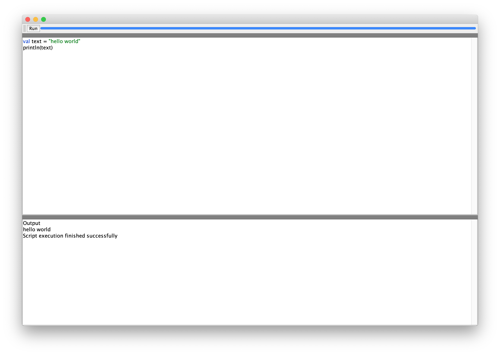

# simple-ide
GUI tool that allows users to enter a script, execute it, and see its output side-by-side. Test task for JetBrains Internships.

You need to have kotlinc in your `PATH` to use the running functionality. For example, you could install it via [SDKMAN!](https://sdkman.io): `sdk install kotlin`.

The application uses hardcoded names for build time history storage directory (the `history` directory) and for the script (`source.kts`).

It's capable of basic syntax highlighting, parsing the code with simple regular expressions.  

## How to build
Simply run `./gradlew assemble`

## How to run
Simply run `./gradlew run`